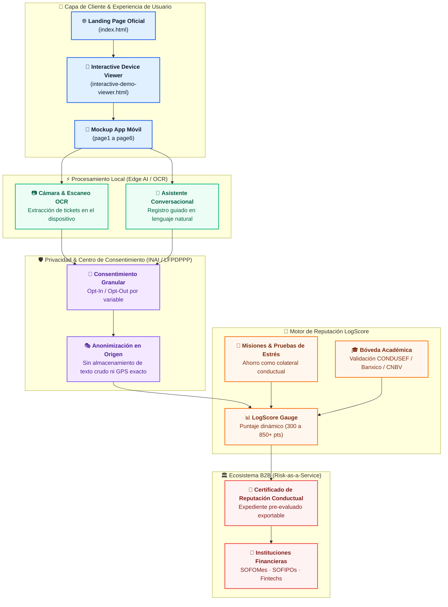

<div align="center">


<br/>


# LogScore — Diario Financiero Inteligente

> *"Un diario financiero que no confía en lo que el usuario promete tener, sino en lo que demuestra empíricamente que puede sostener."*

**Propuesta oficial de ITICsLab para el Crevolution Hackatón 2026**

</div>

---

## 📖 Descripción

**LogScore** es una plataforma y prototipo interactivo de inclusión financiera desarrollado por el equipo **ITICsLab**. Su objetivo principal es transformar los hábitos cotidianos y la rutina diaria en una **reputación financiera verificable** para sectores tradicionalmente excluidos o desatendidos por el sistema bancario convencional (estudiantes universitarios, trabajadores independientes, microemprendedores y personas sin historial en buró de crédito).

A través de un enfoque basado en **colateral conductual** y **evaluación no convencional de riesgos**, LogScore permite al usuario registrar ingresos y gastos mediante lenguaje natural o escaneo OCR en el dispositivo, cumplir misiones de ahorro y generar un expediente pre-evaluado respaldado por certificaciones académicas y autenticación continua.

---

## 🎯 Objetivo y Propuesta de Valor

### 🌟 Objetivo General
Diseñar e implementar un sistema integral de reputación financiera alternativa que conecte a usuarios no bancarizados con instituciones financieras mediante un modelo **Risk-as-a-Service (RaaS)**, reduciendo la asimetría de información y el riesgo de impago.

### 👥 Audiencias Objetivo

<table>
  <thead>
    <tr>
      <th width="50%">🎯 B2C: Usuarios Finales</th>
      <th width="50%">🏛️ B2B: Instituciones Financieras (Fintechs / SOFOMes / SOFIPOs)</th>
    </tr>
  </thead>
  <tbody>
    <tr>
      <td>
        <ul>
          <li><strong>Jóvenes y universitarios (18 a 25 años):</strong> Acceso a su primer crédito sin requerir aval ni historial previo.</li>
          <li><strong>Economía informal y freelance:</strong> Validación de capacidad de pago mediante flujos reales y consistencia de hábitos.</li>
          <li><strong>Personas en recuperación crediticia:</strong> Mecanismos guiados para sanear finanzas mediante misiones y pruebas de estrés.</li>
        </ul>
      </td>
      <td>
        <ul>
          <li><strong>Risk-as-a-Service (RaaS):</strong> API y expedientes pre-evaluados con scoring multidimensional.</li>
          <li><strong>Reducción de cartera vencida y fraude:</strong> Detección temprana de inconsistencias y verificación de identidad continua.</li>
          <li><strong>Adquisición de clientes de bajo riesgo:</strong> Conexión con perfiles disciplinados y capacitados financieramente.</li>
        </ul>
      </td>
    </tr>
  </tbody>
</table>

---

## 🔬 Variables No Convencionales Evaluadas

LogScore trasciende el modelo tradicional de scoring bancario analizando variables conductuales empíricas con estricto apego a la privacidad:

<table border="1" cellspacing="0" cellpadding="8">
  <thead>
    <tr>
      <th>Dimensión</th>
      <th>Variable Analizada</th>
      <th>Impacto en el Score</th>
    </tr>
  </thead>
  <tbody>
    <tr>
      <td><strong>Estabilidad de Rutinas</strong></td>
      <td>Geolocalización y patrones de movilidad anonimizados (sin almacenar GPS exacto).</td>
      <td>Evalúa regularidad y consistencia en la rutina diaria.</td>
    </tr>
    <tr>
      <td><strong>Consumo y Gastos</strong></td>
      <td>Escaneo OCR local de comprobantes y tickets de compra.</td>
      <td>Extrae montos, comercio y clasifica gastos (esenciales vs. hormiga).</td>
    </tr>
    <tr>
      <td><strong>Disciplina Financiera</strong></td>
      <td>Misiones de ahorro sostenido y pruebas de estrés (ej. reservar $50 MXN diarios x 7 días).</td>
      <td>Actúa como colateral conductual demostrable.</td>
    </tr>
    <tr>
      <td><strong>Capacitación (Proof of Knowledge)</strong></td>
      <td>Bóveda de credenciales académicas (CONDUSEF, Banco de México, CNBV).</td>
      <td>Bonificación de puntaje por educación y prevención de fraudes.</td>
    </tr>
    <tr>
      <td><strong>Huella Digital Voluntaria</strong></td>
      <td>Análisis semántico opcional de suscripciones, herramientas de productividad e IA.</td>
      <td>Distingue entre inversión en desarrollo vs. ocio desmedido.</td>
    </tr>
    <tr>
      <td><strong>Antifraude Continuo</strong></td>
      <td>Sello de identidad verificada tras 90 días de actividad regular sin anomalías.</td>
      <td>Garantiza que la cuenta pertenece al titular y previene suplantaciones.</td>
    </tr>
  </tbody>
</table>

---

## 🏗️ Arquitectura del Sistema y Flujo de Datos



---

## 📱 Módulos y Flujo del Prototipo Móvil

El prototipo móvil interactivo consta de 6 pantallas conectadas mediante navegación fluida y eventos `postMessage`:

<table>
  <thead>
    <tr>
      <th>Pantalla</th>
      <th>Nombre del Módulo</th>
      <th>Descripción y Funcionalidad</th>
    </tr>
  </thead>
  <tbody>
    <tr>
      <td><strong>Paso 1</strong></td>
      <td><a href="mobile-app-mockup/page1.html"><code>page1.html</code></a><br/><strong>Bienvenida & Objetivos</strong></td>
      <td>Onboarding personalizado donde el usuario selecciona su meta principal (primer crédito, ordenar deudas, ahorro) y su ocupación (estudiante, freelance, independiente).</td>
    </tr>
    <tr>
      <td><strong>Paso 2</strong></td>
      <td><a href="mobile-app-mockup/page2.html"><code>page2.html</code></a><br/><strong>Centro de Consentimiento</strong></td>
      <td>Gestión granular de privacidad (normativa INAI / LFPDPPP). Toggles para geolocalización anonimizada, escaneo OCR y vinculaciones opcionales (IA y reporte de crédito).</td>
    </tr>
    <tr>
      <td><strong>Paso 3</strong></td>
      <td><a href="mobile-app-mockup/page3.html"><code>page3.html</code></a><br/><strong>Diario Financiero & Score</strong></td>
      <td>Dashboard principal con el <em>LogScore Gauge</em> interactivo (740 pts - Bajo riesgo), desglose de balance semanal (ingresos vs gastos) y factores que suman o restan puntaje.</td>
    </tr>
    <tr>
      <td><strong>Paso 4</strong></td>
      <td><a href="mobile-app-mockup/page4.html"><code>page4.html</code></a><br/><strong>Registro Diario & OCR</strong></td>
      <td>Asistente conversacional interactivo para registrar transacciones diarias en lenguaje natural y módulo de cámara con escáner OCR en vivo para comprobantes de compra.</td>
    </tr>
    <tr>
      <td><strong>Paso 5</strong></td>
      <td><a href="mobile-app-mockup/page5.html"><code>page5.html</code></a><br/><strong>Misiones & Pruebas de Estrés</strong></td>
      <td>Gamificación de hábitos financieros: Reto de retención de ahorro ($50 MXN diarios durante 7 días), misión anti-gastos hormiga e insignia de pre-evaluación aprobada.</td>
    </tr>
    <tr>
      <td><strong>Paso 6</strong></td>
      <td><a href="mobile-app-mockup/page6.html"><code>page6.html</code></a><br/><strong>Expediente Pre-evaluado</strong></td>
      <td>Certificado digital de reputación conductual (ID 740-AX-2024), Bóveda académica con credenciales de CONDUSEF, Banxico y CNBV, y sello antifraude de 90 días activo.</td>
    </tr>
  </tbody>
</table>

---

## 📁 Estructura del Repositorio

```bash
📁 LogScore-Mockup/
├── 📁 assets/                     # Recursos visuales y documentación oficial
│   ├── 📁 pdf/                    # Documentos técnicos y presentaciones del Hackatón
│   │   ├── LogScore_Propuesta_Crevolution.pdf      # Documento formal de la propuesta
│   │   └── LogScorePresentationCrevolution.pdf    # Diapositivas de presentación / pitch
│   ├── cerdito.png                # Mascota / imagotipo de la plataforma
│   ├── icon.svg                   # Isotipo oficial de LogScore
│   └── logo.svg                   # Logotipo completo vectorizado
├── 📁 mobile-app-mockup/          # Pantallas del prototipo de la app móvil
│   ├── page1.html                 # 1. Onboarding y selección de objetivo
│   ├── page2.html                 # 2. Centro de consentimiento y privacidad
│   ├── page3.html                 # 3. Dashboard, LogScore Gauge y balance semanal
│   ├── page4.html                 # 4. Asistente conversacional y escáner OCR
│   ├── page5.html                 # 5. Misiones de ahorro y prueba de estrés
│   └── page6.html                 # 6. Expediente de reputación y bóveda académica
├── .gitignore                     # Configuración de exclusiones Git
├── index.html                     # Landing page principal del proyecto ITICsLab
├── interactive-demo-viewer.html   # Simulador de smartphone interactivo con iframe
├── test.html                      # Vista de pruebas multi-dispositivo en grid
└── README.md                      # Documentación principal del repositorio
```

---

## 📄 Documentación y Recursos Oficiales

En la carpeta [`assets/pdf/`](./assets/pdf/) se encuentran los documentos completos elaborados para el evento:

- 📄 **Propuesta Técnica y de Negocio:** [`LogScore_Propuesta_Crevolution.pdf`](./assets/pdf/LogScore_Propuesta_Crevolution.pdf)
- 📊 **Presentación de Diapositivas:** [`LogScorePresentationCrevolution.pdf`](./assets/pdf/LogScorePresentationCrevolution.pdf)
- 🌐 **Repositorio Oficial en GitHub:** [https://github.com/EdwinSotoHz/LogScore-Mockup.git](https://github.com/EdwinSotoHz/LogScore-Mockup.git)

---

## 🚀 Cómo Visualizar y Ejecutar Localmente

El proyecto está construido con tecnologías web estándar (HTML5, CSS3 y JavaScript moderno) sin dependencias complejas de compilación:
1. Clona o descarga el repositorio:
   ```bash
   git clone https://github.com/EdwinSotoHz/LogScore-Mockup.git
   ```
2. Abre cualquiera de los siguientes archivos directamente en tu navegador favorito:
   - **Landing Page Completa:** `index.html`
   - **Simulador Interactivo de Smartphone:** `interactive-demo-viewer.html`
   - **Malla de Pruebas Multi-pantalla:** `test.html`

## 👥 Equipo y Créditos

<table border="0">
  <tr>
    <td align="center" width="25%">
      <strong>👨‍💻 Edwin Salvador Soto Hernandez</strong><br/>
      <sub>Líder de Proyecto & Desarrollador</sub><br/>
      <small>ITSOEH</small>
    </td>
    <td align="center" width="25%">
      <strong>👨‍🏫 Mtro. Saúl Isaí Soto Ortiz</strong><br/>
      <sub>Mentor Académico</sub><br/>
      <small>ITSOEH</small>
    </td>
    <td align="center" width="25%">
      <strong>👩‍🏫 Yadira Eufemia Gaspar Morales</strong><br/>
      <sub>Mentora Académica</sub><br/>
      <small>ITSOEH</small>
    </td>
    <td align="center" width="25%">
      <strong>🎓 ITSOEH</strong><br/>
      <sub>Instituto Tecnológico Superior del Occidente del Estado de Hidalgo</sub><br/>
      <small>Ing. en Tecnologías de la Información y Comunicaciones</small>
    </td>
  </tr>
</table>

---

<div align="center">

Desarrollado con ❤️ y dedicación por **ITICsLab** para el **Crevolution Hackatón 2026**.

</div>
